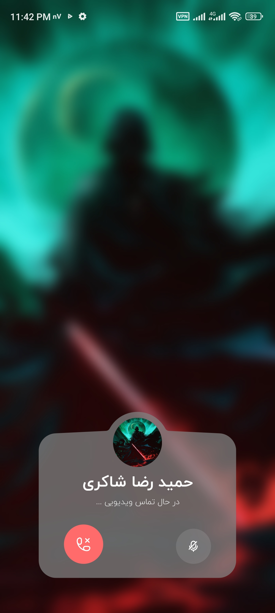

# FaraChat
FaraChat appclication intro page      
Developed with flutter framework   
Because of the confidentiality of the project, I am excused from uploading the APK and the source code.

An organizational chat app with ability to 
* send messega , media , file
* reply message , edit message , delete message
* create group and channel
* voice call and video call
* support for bots (like telegram)

  
  
  
  
  

